# Key Insights and Visualisation Summary

## Patterns, Trends, and Insights

### 1. Spending Score Distribution
- The histogram showed that a **spending score of 50** was the most frequent among customers.
- The boxplot indicated that the **lower quartile (Q1)** was **32**, the **median** was **50**, and the **upper quartile (Q3)** was **73**. This indicates moderate variability in the spending scores of customers.

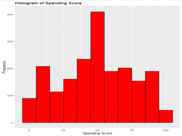 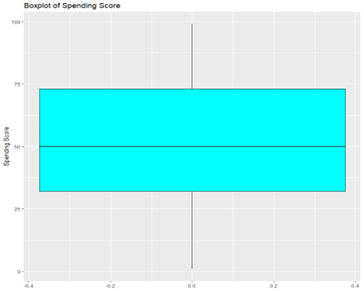

### 2. Decision Tree Analysis
- The decision tree model identified **spending score** as the primary influencing factor for predicting other variables, such as **remuneration** and **loyalty points**.

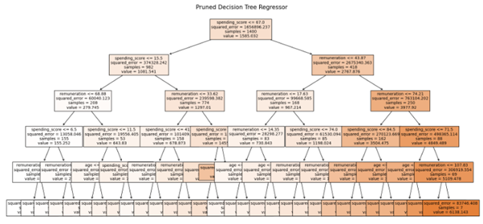

### 3. Age and Remuneration Distributions
- The most common age group was **35-45**, with **Q1 = 29**, a **median = 38**, and **Q3 = 49**.
- For remuneration, the most frequent range was **35-45K**, with **Q1 = 30.34K**, a **median = 47.15K**, and **Q3 = 63.96K**.

**Key Insights from Age and Remuneration Plots:**
- The histogram for age showed that customers primarily fall within the **35-45** range, indicating that middle-aged individuals are the largest group.
- The remuneration histogram indicated that income levels are most often between **35-45K**, giving insight into the spending capacity of the customer base.

 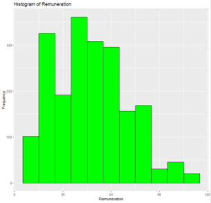

### 4. Customer Segmentation via K-Means Clustering
- **K-means clustering (k = 5)** successfully segmented customers based on spending and remuneration:
  - **Cluster 0** (774 customers): Medium remuneration & spending score.
  - **Cluster 1** (269 customers): Low remuneration & high spending score.
  - **Cluster 2** (356 customers): High remuneration & high spending score.
  - **Cluster 3** (271 customers): Low remuneration & low spending score.
  - **Cluster 4** (330 customers): High remuneration & low spending score.
 
  - 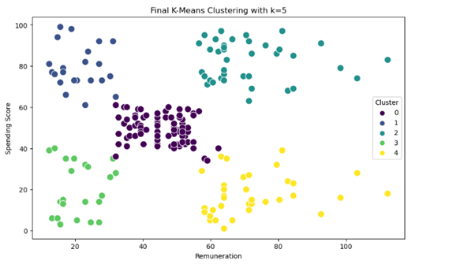

These clusters provide an opportunity for targeted marketing strategies, allowing us to cater to the specific needs of each group.

### 5. Word Frequency in Reviews and Summaries
- An **NLP analysis** of customer reviews highlighted frequent terms like **"game"**, **"fun"**, and **"great"**, revealing what customers value most.

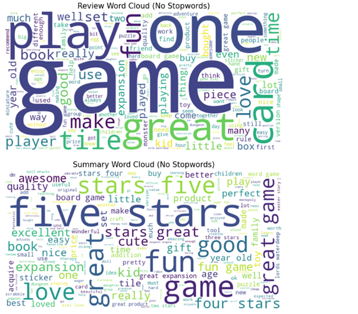

### 6. Sentiment Analysis
- The sentiment analysis indicated a generally **neutral to positive** tone across customer reviews, with most sentiment polarity values ranging from **0.0** to **0.25**.

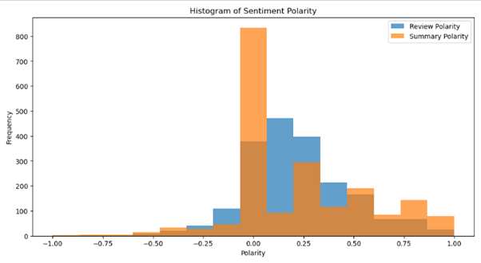

---

## Patterns and Predictions

### Key Findings on Loyalty Points

#### 1. Loyalty Points Distribution
- The boxplot for loyalty points showed:
  - **Q1 = 772**
  - **Median = 1276**
  - **Q3 = 1751**
  - Distribution is right-skewed with high kurtosis, suggesting significant extremes—many customers have either very high or very low loyalty points.

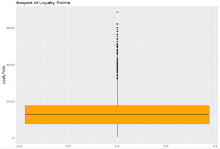 

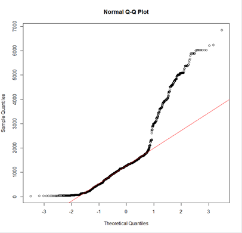

#### 2. Regression Analysis for Loyalty Points

- **Impact of Age**:
  - Minimal effect on loyalty points with **R-squared = 0.0018** and a negative coefficient of **-4.0128**, suggesting that age does not significantly affect loyalty accumulation.

  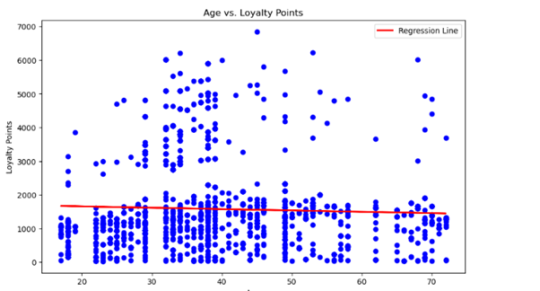

- **Impact of Remuneration**:
  - Positive correlation between remuneration and loyalty points with **R-squared = 0.3795**. Each unit increase in remuneration is associated with approximately **34.19** more loyalty points.

  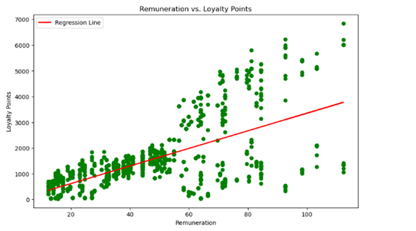

- **Impact of Spending Score**:
  - Spending score showed a positive correlation with loyalty points with an **R-squared = 0.4520**. An increase in spending score is associated with an increase of **33.06** loyalty points, indicating greater loyalty for more engaged, high-spending customers.

  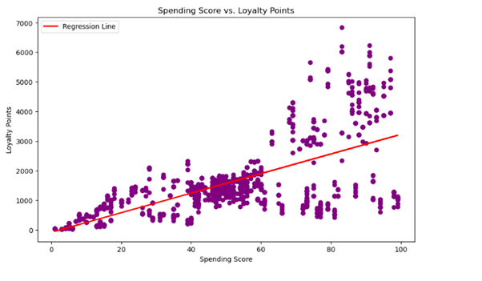

### 3. Customer Retention Strategies
- **Key Takeaway**: Positive relationships between **remuneration**, **spending score**, and **loyalty points** reveal opportunities for enhancing customer loyalty through targeted incentives aimed at customers with higher remuneration and spending scores.

## Recommendations

### 1. Tailored Marketing Strategies
- Develop and implement **cluster-specific marketing** strategies based on the segmentation results to optimise loyalty programmes effectively.
  - Example: Offer exclusive rewards for **Cluster 2** (high remuneration & high spending).
  - Design incentive programmes for **Cluster 3** to encourage higher spending.

### 2. Enhance Product Messaging
- Use insights from **customer feedback** (e.g., words like "Game," "Great," "Fun") in marketing campaigns to align with customer expectations and increase campaign effectiveness.

### 3. Drive Loyalty through Targeted Promotions
- Offer personalised promotions to **high-potential customers** based on their remuneration and spending scores. Such promotions can be instrumental in increasing loyalty points and boosting overall customer engagement.

### 4. Consideration of Data Distribution in Modeling
- Given the non-normal distribution of loyalty points, consider:
  - **Data transformations** (e.g., log or square root transformations) to improve predictive model performance.
  - Alternatively, use **non-parametric models** that are more robust to skewed distributions.

