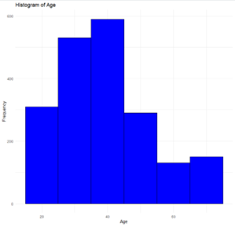

# Turtle Games Customer Analysis

## Overview
This project aims to analyse Turtle Games' customer data to evaluate customer engagement, understand customer segmentation, and utilise customer feedback for improved marketing campaigns. By leveraging customer data and segmentation, Turtle Games intends to refine their marketing approach, enhance customer retention, and optimise sales performance.

## Business Background and Key Questions
**Turtle Games** is a global manufacturer and retailer of gaming products. This analysis focuses on:

- **Customer Loyalty Points**: Identifying factors such as age, income, and spending habits that influence loyalty points to optimise loyalty programmes.
- **Customer Segmentation for Marketing**: Identifying distinct customer groups through clustering to tailor marketing campaigns effectively.
- **Customer Feedback Analysis**: Using Natural Language Processing (NLP) to understand customer reviews and improve satisfaction.

## Data Cleaning and Preparation
### Steps Taken:
1. **Initial Data Exploration**
   - Imported the `turtle_reviews` dataset and explored using `head()`, `info()`, and `describe()` to understand structure, central tendencies, and distribution.

2. **Removing Unnecessary Columns**
   - Removed columns like **"language"** and **"platform"** to focus on relevant features.

3. **Handling Missing Values**
   - Checked for missing values using `isna().sum()`.
   - Removed rows with null values to ensure consistent and reliable data.

## Data Analysis Approach
### Tools and Libraries
- **Python**:
  - **Pandas, NumPy**: For data manipulation and numerical analysis.
  - **Matplotlib, Seaborn**: For data visualisation.
  - **Scikit-Learn**: For regression models, decision trees, clustering, and model evaluation.
  - **Statsmodels**: For statistical analysis and regression.
  - **NLTK, TextBlob, WordCloud**: For NLP analysis, sentiment detection, and visualisation.
  
- **R**:
  - **ggplot2, dplyr**: For visualising and summarising data.
  - **moments, car, stats**: For measuring data characteristics, multicollinearity, and statistical tests.

## Key Insights and Visualisation Summary

### Patterns, Trends, and Insights

1. **Spending Score Distribution**:
   - The most frequent spending score was **50**, with a **Q1 of 32**, **median of 50**, and **Q3 of 73**, indicating moderate variability.
   
    

2. **Decision Tree Analysis**:
   - The **spending score** was the primary predictor for other factors like **remuneration** and **loyalty points**, indicating its importance.

   

3. **Age and Remuneration Distributions**:
   - **Age**: Most common group is **35-45**, with **Q1 = 29**, **median = 38**, **Q3 = 49**.
   - **Remuneration**: Frequent range is **35-45K**, with **Q1 = 30.34K**, **median = 47.15K**, **Q3 = 63.96K**.

    

4. **Customer Segmentation via K-Means Clustering**:
   - **K-means clustering (k = 5)** segmented customers effectively:
     - **Cluster 0**: Medium remuneration & spending.
     - **Cluster 1**: Low remuneration, high spending.
     - **Cluster 2**: High remuneration & spending.
     - **Cluster 3**: Low remuneration & spending.
     - **Cluster 4**: High remuneration, low spending.

   Tailored marketing can be developed based on these segments.

   

5. **Word Frequency in Reviews and Sentiment Analysis**:
   - Frequent terms: **"game," "fun,"** and **"great"** highlight positive customer sentiment.
    
   - Sentiment was predominantly **neutral to positive**, reflecting satisfaction.
    

## Patterns and Predictions

### Key Findings on Loyalty Points

1. **Loyalty Points Distribution**:
   - Loyalty points showed **Q1 = 772**, **median = 1276**, **Q3 = 1751**, with a right-skewed distribution, suggesting many customers have either very high or very low loyalty points..

   
   

3. **Regression Analysis for Loyalty Points**:
   - **Age**: Minimal impact on loyalty points, with **R-squared = 0.0018**, suggesting age isn't a significant factor.

     

   - **Remuneration**: Positive correlation with **R-squared = 0.3795**, indicating that higher remuneration predicts more loyalty points.

     

   - **Spending Score**: Positive correlation with **R-squared = 0.4520**, suggesting that a higher spending score significantly increases loyalty points.

     

4. **Customer Retention Strategies**:
   - Higher **remuneration** and **spending scores** correlate with more loyalty points, suggesting targeted incentives for these segments can improve retention.

## Recommendations

1. **Tailored Marketing Strategies**:
   - Develop **cluster-specific campaigns**:
     - **Cluster 2**: Offer exclusive rewards to maintain high spending.
     - **Cluster 3**: Design incentive programmes to encourage spending.

2. **Enhanced Product Messaging**:
   - Utilise frequent customer feedback terms like "Game," "Great," and "Fun" in marketing to align with customer expectations and increase engagement.

3. **Drive Loyalty through Targeted Promotions**:
   - Focus promotions on **high-potential customers** based on remuneration and spending scores to maximise loyalty point accumulation and retention.

4. **Consideration of Data Distribution in Modelling**:
   - Given the skewed distribution of loyalty points:
     - Use **data transformations** (e.g., log transformation) to normalise data.
     - Alternatively, consider **non-parametric models** for improved robustness in predictions.

